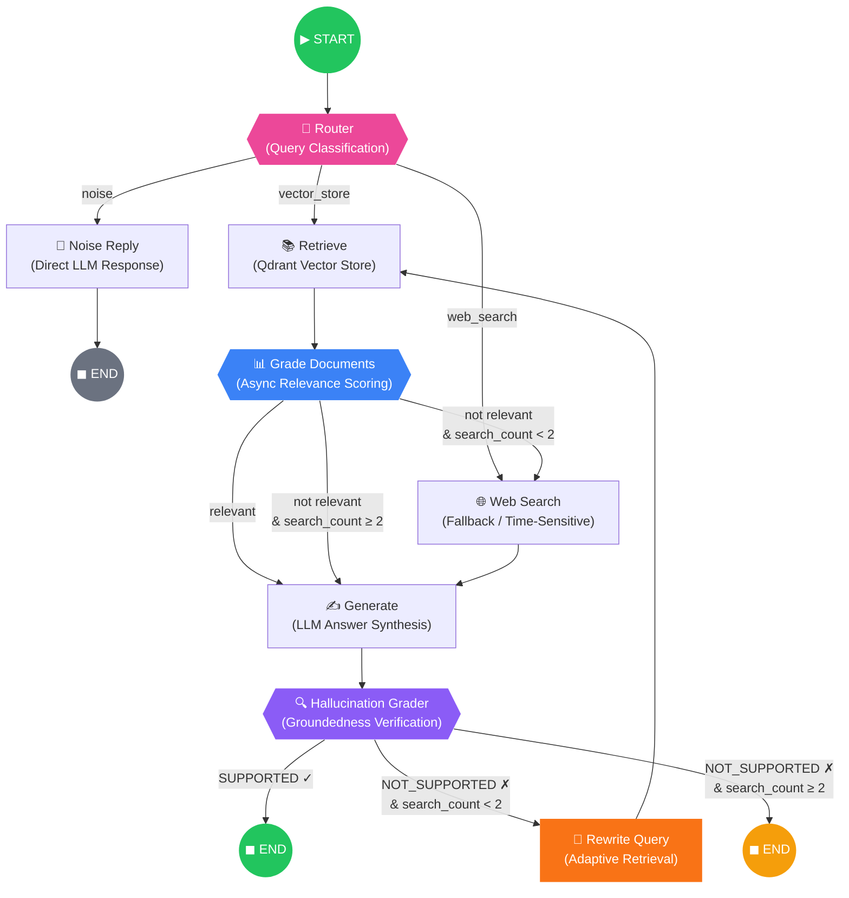

<div align="center">

# 🧠 LangGraph Adaptive RAG Engine

**基于 Flow-Engineering 的有向有环图（DCG）自适应检索增强生成引擎**

*Production-grade Adaptive RAG with self-correcting hallucination loop, async concurrent grading, and graceful degradation.*

[](https://www.python.org/downloads/)
[](https://github.com/langchain-ai/langgraph)
[](LICENSE)

</div>

---

## 🔭 Project Overview

Traditional RAG pipelines suffer from a fundamental architectural limitation: they operate as **acyclic, unidirectional flows** — retrieve once, generate once, output. When the retrieved context is stale, irrelevant, or insufficient, the system either hallucinate silently or produce low-confidence answers with no self-healing mechanism.

**LangGraph Adaptive RAG Engine** redesigns this paradigm using a **Directed Cyclic Graph (DCG)** topology built on LangGraph's state machine primitives. The core innovation is a **self-correcting reflection loop** — after generation, the system automatically evaluates hallucination risk against source documents. When ungrounded claims are detected, the engine triggers a **query rewrite → re-retrieve → re-grade → re-generate** cycle, capped by a bounded iteration guard to guarantee termination.

This is not a wrapper around LangChain. It is a **from-scratch state machine architecture** with:

- **8 typed graph nodes** implementing a complete query lifecycle
- **3 conditional routing edges** with branch-specific fallback policies
- **Async-first design** with `asyncio.gather` parallel document grading
- **Graceful degradation** from Qdrant vector store to web search on connection failure
- **Mock LLM layer** for deterministic local testing without API keys

---

## 🏗️ Architecture Topology

The entire engine is a single compiled LangGraph `StateGraph`. Below is the **exact state machine topology** — every node, every conditional edge, and every terminal state:



### State Machine Semantics

| Edge | Condition | Behavior |
|------|-----------|----------|
| Router → Noise Reply | `destination == "noise"` | Casual/small-talk — direct LLM answer, no retrieval |
| Router → Web Search | `destination == "web_search"` | Time-sensitive queries — bypass vector store entirely |
| Router → Retrieve | `destination == "vector_store"` | Factual/domain queries — proceed with RAG pipeline |
| Grade → Generate | `is_relevant == True` | Sufficient context found — synthesize answer |
| Grade → Web Search | `is_relevant == False AND search_count < 2` | Insufficient context — fallback to web search |
| Hallucination → END | `verdict == "SUPPORTED"` | Answer is fully grounded — pipeline complete |
| Hallucination → Rewrite | `verdict == "NOT_SUPPORTED" AND search_count < 2` | Ungrounded claims detected — adaptive retry loop |
| Rewrite → Retrieve | Always | Query rewritten — re-enter retrieval phase |

**Termination guarantee:** Both `_grade_route` and `_hallucination_route` enforce `search_count < 2`, capping total retrieval iterations at **2 cycles** to prevent infinite loops.

---

## ⚡ Technical Highlights

> **Source Map** — every feature below links to its exact implementation file and line,
> so you can jump straight to the source in under 30 seconds.

### 1. Type-Safe State Machine (Pydantic Runtime Validation)

- **`AgentState`** model with `Field(...)` constraints on every field → `src/state.py:17`
- **`HallucinationReport`** with `ge=0.0, le=1.0` bounds → `src/state.py:9`
- **`QueryRoute`** with `Literal["noise", "vector_store", "web_search"]` → `src/chains/router.py:9`
- **`DocGrade`** / **`HallucinationGrade`** structured output models → `src/chains/doc_grader.py:7` / `src/chains/hallucination_grader.py:9`

### 2. Async Concurrent Document Grading (`asyncio.gather`)

- **Parallel grading implementation** using `asyncio.gather` with `return_exceptions=True` → `src/nodes/grade_documents.py:18-33`
- Reduces wall-clock from `O(n × LLM_latency)` to `O(LLM_latency)` by concurrently scoring all retrieved chunks.

### 3. Graceful Degradation (Qdrant → Web Search)

- **Qdrant exception handling** returns empty docs on connection failure → `src/nodes/retrieve.py:24-30`
- Downstream `grade_documents` flags `is_relevant=False`, triggering automatic web search fallback via conditional edge in `src/graph.py`.

### 4. MemorySaver Checkpointer

- **Graph compilation with `MemorySaver`** → `src/graph.py:232-233`
- **Thread-level session isolation** via `thread_id` config in `src/main.py:30,41`
- Enables breakpoint recovery and full state replay across pipeline runs.

### 5. Mock LLM Layer for Deterministic Testing

- **`MockChatModel`** (extends `BaseChatModel`) → `src/mock_llm.py:12`
- Keyword-driven deterministic responses; auto-activates when API key is empty/placeholder → `src/graph.py:16`
- Zero network calls — entire pipeline testable offline.

---

## 📁 Project Structure

```
langgraph_adaptive_rag_engine/
├── .env                          # Environment variables (API keys, Qdrant config)
├── .gitignore                    # Git exclusion rules
├── .python-version               # Python 3.12
├── pyproject.toml                # Project metadata & tool config
├── test_sanity.py                # Unit tests for state models & node imports
├── main.py                       # Root entry stub
│
├── scripts/
│   └── populate_qdrant.py       # Qdrant seed script (SiliconFlow embeddings)
│
└── src/
    ├── __init__.py
    ├── main.py                   # 🚀 Primary entry point — runs both demo cases
    ├── graph.py                  # 🔧 Core graph topology — 8 nodes, 3 conditional edges
    ├── state.py                  # 📋 Pydantic state models (AgentState, HallucinationReport)
    ├── mock_llm.py              # 🧪 Deterministic mock LLM for offline testing
    │
    ├── config/
    │   ├── __init__.py           # Re-exports Settings
    │   └── settings.py           # Pydantic BaseSettings from .env
    │
    ├── chains/
    │   ├── __init__.py
    │   ├── router.py             # Query classification chain (noise/vector/web)
    │   ├── doc_grader.py         # Document relevance grading chain
    │   └── hallucination_grader.py  # Hallucination detection chain
    │
    └── nodes/
        ├── __init__.py
        ├── retrieve.py           # Qdrant retrieval with graceful degradation
        ├── grade_documents.py    # Async concurrent document grading
        ├── web_search.py         # Simulated web search fallback
        └── generate.py           # LLM answer synthesis
```

---

## 🚀 Quick Start

### Prerequisites

- **Python 3.12+**
- **[uv](https://docs.astral.sh/uv/)** — fast Python package manager
- **Qdrant** (optional) — for vector store retrieval; without it, the pipeline degrades to web search mode

### 1. Clone & Install

```bash
git clone https://github.com/YOUR_USERNAME/langgraph-adaptive-rag-engine.git
cd langgraph-adaptive-rag-engine
uv sync
```

### 2. Configure Environment

```bash
cp .env.example .env    # or create .env manually
```

Edit `.env` with your credentials:

```ini
OPENAI_API_KEY=sk-your-key-here
OPENAI_API_BASE=https://api.openai.com/v1    # or any OpenAI-compatible endpoint
LLM_MODEL=gpt-4o-mini
LLM_PROVIDER=openai

QDRANT_URL=http://localhost:6333
QDRANT_COLLECTION=adaptive_rag

TOP_K=4
SCORE_THRESHOLD=0.5
```

> **No API key?** The engine auto-detects empty/placeholder keys and switches to the built-in `MockChatModel` — run it fully offline with zero configuration.

### 3. (Optional) Populate Qdrant

```bash
# Start Qdrant locally
docker run -p 6333:6333 qdrant/qdrant

# Seed with sample documents
uv run scripts/populate_qdrant.py
```

### 4. Run the Engine

```bash
uv run src/main.py
```

This executes two demo cases:
- **Case A** — `"What is Retrieval-Augmented Generation (RAG)?"` → vector_store route, document grading, generation, hallucination check
- **Case B** — `"What are the latest developments in quantum computing as of 2026?"` → web_search route with full reflection loop

### 5. Run Tests

```bash
uv run pytest test_sanity.py -v
```

---

## 🧩 Customization

| Want to... | Change this |
|------------|-------------|
| Use Anthropic instead of OpenAI | Set `LLM_PROVIDER=anthropic` in `.env` |
| Add real web search | Replace `src/nodes/web_search.py` with Tavily/SerpAPI/Bing integration |
| Use vector similarity search | Replace `src/nodes/retrieve.py` scroll+keyword with Qdrant's `query_points` API |
| Increase retry depth | Modify `search_count < 2` guard in `src/graph.py` edges |
| Add persistence | Swap `MemorySaver` for `SqliteSaver` or `PostgresSaver` in graph compilation |

---

## 📐 Design Decisions

**Why DCG (Directed Cyclic Graph) over DAG?**
Traditional RAG is a DAG — data flows one way. The hallucination reflection loop introduces a **cycle** that enables self-correction. LangGraph's state machine naturally supports cycles with explicit termination guards, making this both safe and expressive.

**Why Pydantic BaseModel over TypedDict for AgentState?**
TypedDict provides structural typing at the class level but no runtime validation. Pydantic `BaseModel` enforces field types, default values, and custom validators on **every state transition** — catching corruption before it propagates through the graph.

**Why `search_count` as a circuit breaker?**
Unbounded retry loops are the #1 failure mode in self-correcting architectures. A simple integer counter in the state, checked at every conditional edge, provides a **deterministic termination guarantee** with zero external dependencies.

---

## 🤝 Contributing

Contributions are welcome. Please open an issue first to discuss proposed changes.

---

## 📄 License

MIT License — see [LICENSE](LICENSE) for details.
